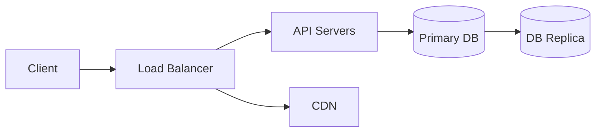

# 📐 System Design Fundamentals

> A personal, opinionated guide to system design — written the way I actually think about it.

This repository documents my own understanding of system design fundamentals: from gathering requirements to sketching architecture, choosing protocols, and designing APIs. It's meant to be a living reference — for interviews, for building real systems, and for anyone who wants a no-fluff starting point.

---

## 📖 Read the Full Guide

The complete guide is available as a Hashnode blog post:

👉 **[System Design Fundamentals — My Own Take](#)** *(add your Hashnode link here)*

---

## 📚 What's Covered

| # | Topic |
|---|---|
| 1 | [Functional Requirements](#) |
| 2 | [Non-Functional Requirements](#) — Availability, Consistency, Latency, Read/Write Ratio |
| 3 | [Entities & Database Tables](#) |
| 4 | [High-Level System Architecture](#) |
| 5 | [Networking & the OSI Model](#) |
| 6 | [Load Balancers — Layer 4 vs Layer 7](#) |
| 7 | [Communication Protocols — WebSocket vs SSE](#) |
| 8 | [CDN — Content Delivery Network](#) |
| 9 | [API Design — Auth, Rate Limiting, Pagination](#) |
| 10 | [Caching — Eviction, Invalidation, Redis vs Memcached](#) |

---

## 🗂️ Repository Structure

```
system-design-fundamentals/
├── README.md                          ← You are here
├── system-design-fundamentals.md     ← Core system design guide
└── caching.md                        ← Deep dive into caching
└── replication.md                     ← Deep dive into replication and failover
```

---

## 🧠 Key Concepts at a Glance

### High-Level Architecture



### The Core Trade-off — CAP Theorem

A distributed system can only guarantee **two of three**:

- **C**onsistency — every read gets the latest write
- **A**vailability — every request gets a response
- **P**artition Tolerance — the system works despite network failures

Most real-world systems (e.g. Amazon, Flipkart) choose **AP** — availability over strict consistency.

### Load Balancer Types

| Type | Layer | Routing Based On | Speed |
|---|---|---|---|
| Layer 7 | Application | URL, headers, cookies | Slower, smarter |
| Layer 4 | Transport | IP address + port | Faster, dumber |

### Communication Protocols

| Protocol | Direction | Connection | Best For |
|---|---|---|---|
| WebSocket | Bi-directional | Persistent TCP | Chat, gaming, collaboration |
| SSE | Uni-directional | HTTP (closes after response) | News feeds, live scores |
| REST | Request/Response | Stateless HTTP | General APIs |

### Caching Strategies

| Strategy | Write To | Best For |
|---|---|---|
| Cache Aside | DB first, then cache | Most use cases — flexible |
| Write Through | Cache + DB simultaneously | Strong consistency |
| Write Back | Cache first, DB async | High write throughput |

| Eviction Policy | Removes |
|---|---|
| LRU | Least recently accessed |
| LFU | Least frequently accessed |
| FIFO | Oldest inserted |

---

Use this before any interview or greenfield project:

- [ ] Define **functional requirements** — what does the system do?
- [ ] Define **non-functional requirements** — availability, consistency, latency, read/write ratio
- [ ] Identify **out-of-scope** items explicitly
- [ ] Map out **entities** (database tables)
- [ ] Sketch the **high-level architecture** — client, load balancer, API servers, DB, CDN
- [ ] Choose the right **communication protocol** — REST, WebSocket, or SSE
- [ ] Design your **APIs** — auth, rate limiting, response structure, pagination

---

## 🤝 Contributing

Found a mistake, have a better explanation, or want to add a new topic? PRs and issues are welcome.

1. Fork the repo
2. Create a branch: `git checkout -b topic/your-topic`
3. Commit your changes: `git commit -m "add: your topic"`
4. Push and open a Pull Request

---

## 📝 License

This project is open source under the [MIT License](LICENSE).

---

*No system is perfect from day one. The goal is to make deliberate trade-off decisions based on requirements — and improve iteratively.*
