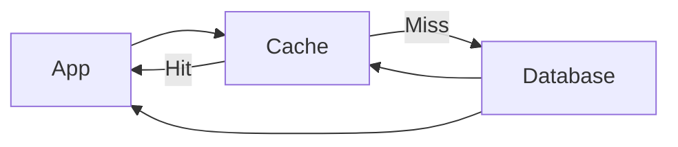
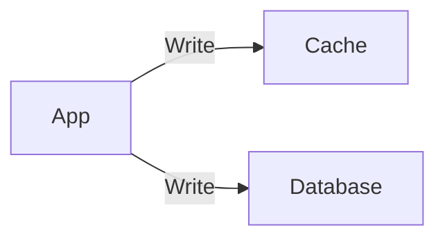
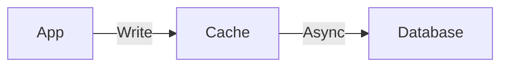

# Caching

When we talk about caching, we have to keep in mind *when* we actually need it.

There are two types of caching mechanisms:

1. **In-memory caching**
2. **Server caching**

---

## In-Memory Caching

We consider in-memory caching when we have **static content** to serve to users — like tokens, metadata, and so on.

Examples: `localStorage`, `cookie storage`

---

## Server Caching

We need server-side caching when users **frequently access the same data**.

For example — imagine a viral reel on Instagram. It's worth keeping that data in cache because millions of users will request the exact same content.

```
read >> write
```

We can cache the data with a key like:

```
user:123:post:2432
```

So when any user requests that post, the data is pulled from cache rather than the database.

### Why does this matter?

Assume we have **100M users** and **10M of them** check the same post or reel.

If we fetch from the database every single time:

```
10ms to 50ms per DB call × 10M users = extremely expensive
```

That level of traffic hitting the database repeatedly will push the server toward its **SPOF (Single Point of Failure)**.

This is where caching comes in.

If we fetch the data from the database **once**, store it in cache, and serve every subsequent request from there — it takes only **~1ms**. Much faster, much cheaper.

---

## The Cache Miss Problem — Single Flight / Coalescing

Now a new problem arises.

Cache lives in memory. When the server restarts, **the data is lost**. What happens the next day when 10M users simultaneously request that post and the cache is empty?

This is called a **cache stampede** — all requests hit the database at once.

We can solve this with the **Single Flight (Coalescing) mechanism**:

> Only **one request** goes to the database. All other requests wait. Once the data is fetched and stored in cache, it is served to everyone waiting.

This handles both the **cache miss** and **cache stampede** problems in one go.

---

## Eviction Policies

Cache has memory limits — say, **100GB**. We can't keep everything in cache forever. We need a strategy to decide what to remove when the cache is full.

Common eviction policies:

| Policy | Full Name | How it works |
|---|---|---|
| **LRU** | Least Recently Used | Removes the data that was accessed the longest time ago |
| **LFU** | Least Frequently Used | Removes the data that is accessed the least number of times |
| **FIFO** | First In First Out | Removes the oldest data that was added to the cache |

**LRU is used most of the time** — it's the most practical for general-purpose caching because recently accessed data is more likely to be accessed again soon.

---

## TTL — Time To Live

Always set a **TTL** for cached data.

We don't want stale data sitting in cache indefinitely. TTL ensures the data automatically expires after a defined period, keeping memory usage in check and data reasonably fresh.

---

## Cache Invalidation — Keeping Cache and Database in Sync

Here's a common scenario: a user updates their profile in the database, but the cache still holds the old data. The next request gets served **stale data**.

To prevent this, we need to keep the cache and database **in sync**. There are three main approaches:

### 1. Cache Aside

The application manages the cache manually.

- On a **read**: check cache first. If miss, fetch from DB, store in cache, return data.
- On a **write**: update the database, then **invalidate or update** the cache entry.

This is the most commonly used approach because it is **flexible** and gives the application full control.



### 2. Write Through

The application writes to **cache and database simultaneously**.

- Every write goes to both at the same time.
- Cache is always in sync with the database.
- **Downside:** higher write latency since both writes must complete.



### 3. Write Back (Write Behind)

The application writes to **cache first**, and the database is updated **asynchronously** later.

- Very fast writes since only the cache is updated immediately.
- **Downside:** if the cache goes down before the async write completes, data is lost.



> **Note:** Cache Aside is supported natively by most caching libraries. Write Through and Write Back require **custom application logic** since libraries like Redis and Memcached do not implement these patterns out of the box.

---

## Choosing the Right Caching Library

| Library | Best For |
|---|---|
| **Redis** | Persistent cache, complex data structures, pub/sub, long TTLs |
| **Memcached** | Simple, high-speed, short-lived caching at scale |
| **Ehcache** | JVM-based applications (Java/Spring) |

**Redis** is the most widely used choice today because it supports rich data types, optional persistence, clustering, and is battle-tested at scale.

---

## Summary

| Concept | Key Takeaway |
|---|---|
| In-memory caching | Good for static, session-level data |
| Server caching | Good for frequently read, rarely written data |
| Single Flight | Prevents cache stampede on cold start |
| LRU Eviction | Most practical general-purpose eviction policy |
| TTL | Always set it — prevents stale data buildup |
| Cache Aside | Most flexible, most commonly used |
| Write Through | Strong consistency, higher write latency |
| Write Back | Fastest writes, risk of data loss |