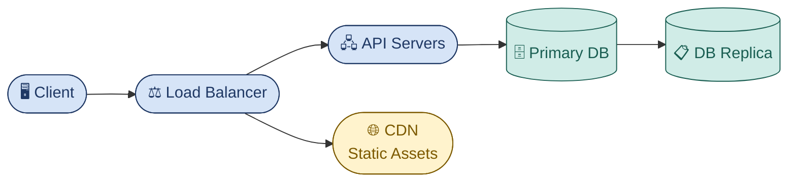
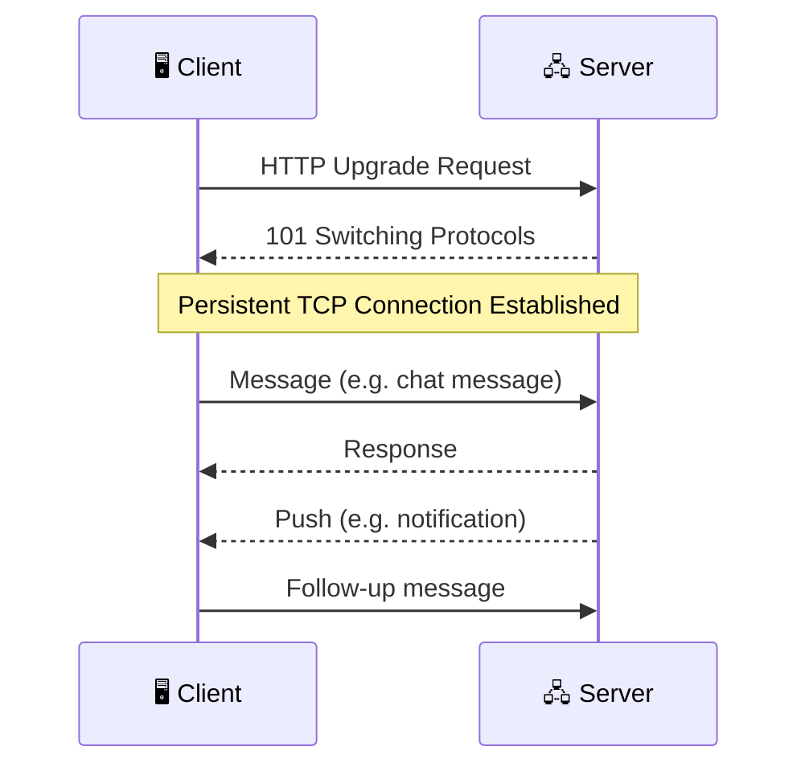
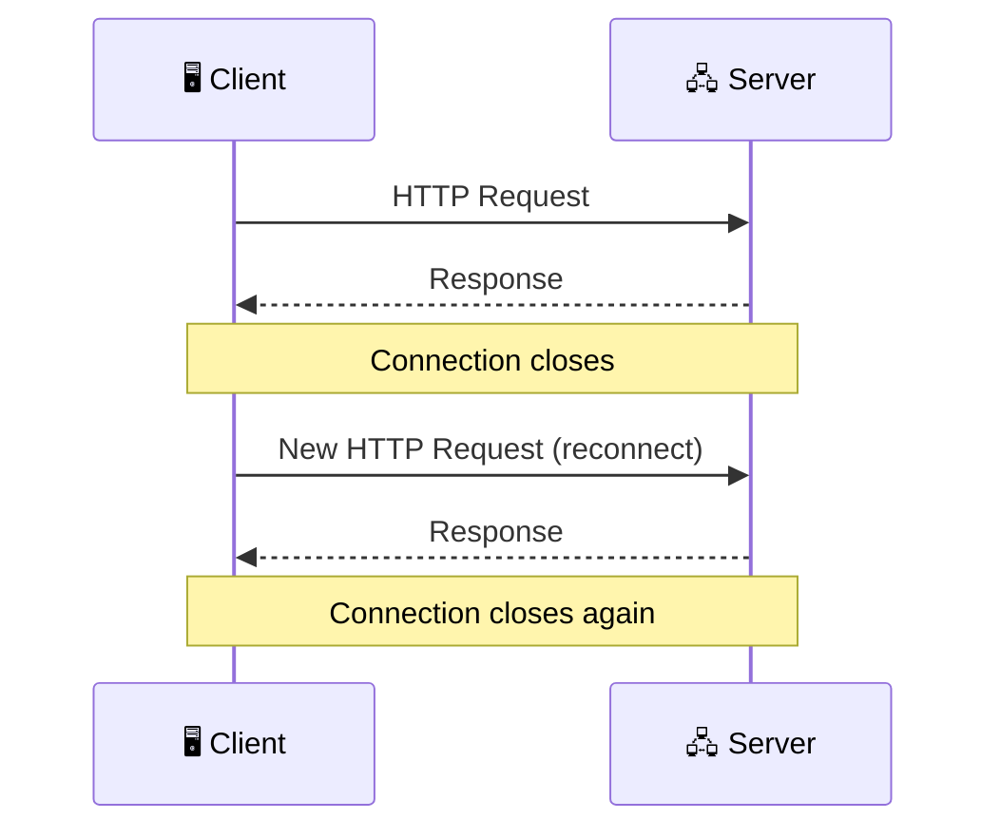
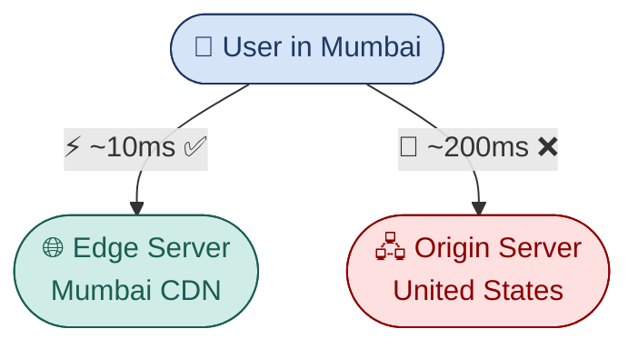

# System Design Fundamentals — My Own Take

When it comes to system design, we often ask: *how do we build a system that is efficient and accurate?*

The truth is — **there is no single perfect design**. A system becomes more efficient over time as we identify and address its **Single Point of Failure (SPOF)**. Once we recognise those failure points, we can iteratively improve the system.

There are key parameters we must consider when building a system. Let's walk through each one.

---

## 1. Functional Requirements

Functional requirements define **what the system does** — its core features and capabilities.

While requirements may evolve over time, we start by designing around the fundamental functionalities first, then progressively enhance the system on the go.

---

## 2. Non-Functional Requirements

Non-functional requirements are just as critical as functional ones — because based on these, we decide *how* efficient and reliable our system needs to be.

### Availability vs. Consistency

The first question to ask: **do we need Availability > Consistency, or the other way around?**

**Availability** refers to how reliably the system responds to user requests at any given time. E-commerce platforms like Amazon and Flipkart prioritise availability — the system must remain accessible even under heavy load.

**Consistency** refers to how up-to-date the data served to users is. During high-traffic events like Amazon's Great Indian Sale or Flipkart's Big Billion Days, inventory updates may lag. For example, a product may appear in stock on the listing page but show as **out-of-stock at checkout** — this is a deliberate trade-off where availability takes priority over strict consistency.

> 💡 This trade-off is described formally by the **CAP Theorem** — a distributed system can only guarantee two of three: Consistency, Availability, and Partition Tolerance.

### Latency

Latency determines how responsive the system feels.

- **High latency** = slow system
- **Low latency** = fast system

For example, a low-latency system should handle **10 million requests within 80ms**. We define latency targets based on the expected **DAU (Daily Active Users)**.

### Read/Write Ratio

Estimate whether your system is **read-heavy** or **write-heavy**.

Most systems follow: `reads >> writes`

This directly influences decisions around caching strategy, database replication, and indexing.

### Out-of-Scope Requirements

Explicitly acknowledge what is **out of scope**. This keeps the design focused while ensuring awareness of future considerations. Examples:

- Fault tolerance
- GDPR compliance (General Data Protection Regulation)
- Multi-region support

---

## 3. Entities (Database Tables)

After clarifying requirements, identify the **core data entities** the system will manage. These map directly to your database tables.

Common examples: `User`, `Booking`, `Ticket`, `Product`, `Order`

---

## 4. High-Level System Architecture

With requirements defined and entities identified, we can sketch the high-level architecture.



Each component plays a distinct role:

| Component | Role |
|---|---|
| **Client** | Browser, mobile app, or third-party service making requests |
| **Load Balancer** | Distributes incoming traffic across multiple API servers |
| **API Servers** | Handle business logic and process requests |
| **Primary DB** | Source of truth for all writes |
| **DB Replica** | Read replicas to handle high read traffic |
| **CDN** | Serves static content (images, CSS, JS) from edge locations |

---

## 5. Networking Layers — The OSI Model

The OSI model defines **7 layers** of network communication. Understanding this helps us make informed decisions about protocols and load balancers.

| Layer | Name | Key Protocols / Examples |
|---|---|---|
| 7 | **Application Layer** | HTTP, WebSocket, DNS, SMTP |
| 6 | **Presentation Layer** | TLS/SSL, Encoding |
| 5 | **Session Layer** | Session management, Authentication |
| 4 | **Transport Layer** | TCP, UDP |
| 3 | **Network Layer** | IP Addressing, Routing |
| 2 | **Data Link Layer** | MAC Addresses, Ethernet |
| 1 | **Physical Layer** | Cables, Signals, Hardware |

The two most relevant protocols in system design:

- **TCP** — reliable, connection-oriented (Transport Layer)
- **HTTP** — application-level protocol built on top of TCP (Application Layer)

---

## 6. Load Balancers

There are **two types of load balancers**, each operating at a different OSI layer.

### Layer 7 — Application Layer Load Balancer

- Operates at the HTTP/HTTPS level
- Routes traffic based on URL path, headers, and cookies
- Smarter routing decisions
- Slightly more overhead

### Layer 4 — Transport Layer Load Balancer

- Operates at the TCP/UDP level
- Routes based on IP address and port only
- Faster and lower latency
- Cannot inspect the content of requests

> 💡 **Rule of thumb:** Use Layer 7 when you need intelligent routing (e.g., routing `/api` to one server group and `/static` to another). Use Layer 4 when raw speed matters most.

---

## 7. Communication Protocols

Choosing the right communication protocol is critical depending on the use case.

### WebSocket

WebSocket is a **bi-directional, persistent** communication protocol running over TCP.



- Persistent TCP connection
- Both client and server can send messages freely
- **Best for:** real-time chat, multiplayer gaming, live collaboration tools

### Server-Sent Events (SSE)

SSE is **uni-directional** — the server pushes data to the client over HTTP.



- HTTP-based, simpler to implement
- Client must open a new connection to send data
- **Best for:** live news feeds, stock price updates, sports scores

---

## 8. CDN — Content Delivery Network

Geography and network distance significantly impact latency. The further a user is from your server, the slower the response.

A **CDN** solves this by caching static content (images, CSS, JS, videos) on **edge servers** distributed globally — serving content from a location near the user.



CDNs are typically combined with **database replication** and **partitioning** for a complete low-latency architecture.

---

## 9. API Design

API design is one of the most important aspects of system design. Most of the time we build **REST APIs** — and interviewers expect that unless you propose and justify an alternative (e.g., GraphQL or gRPC).

### Key Considerations

**Authentication**
Use **JWT (JSON Web Token)** to authenticate users. The token is issued on login and sent with every subsequent request via the `Authorization` header.

```http
POST /api/users/login
→ Returns: { token: "eyJhbGci..." }

GET /api/users/profile
Authorization: Bearer eyJhbGci...
```

**Rate Limiting**
Protect your API from abuse, bots, and DDoS attacks by limiting how many requests a client can make in a given time window.

```http
HTTP/1.1 429 Too Many Requests
X-RateLimit-Limit: 100
X-RateLimit-Remaining: 0
X-RateLimit-Reset: 1716123456
```

**Response Structure**
Define a consistent, predictable response schema across all endpoints.

```json
{
  "success": true,
  "data": { ... },
  "error": null,
  "meta": {
    "page": 1,
    "total": 240
  }
}
```

**Pagination**
For list endpoints, always implement pagination. Two common approaches:

| Type | How it works | Best for |
|---|---|---|
| **Offset-based** | `?page=2&limit=20` | Simple datasets, admin panels |
| **Cursor-based** | `?cursor=abc123&limit=20` | Large datasets, infinite scroll feeds |

> 💡 **Cursor-based pagination** is generally preferred for large datasets — it avoids the "page drift" problem that offset pagination suffers from when data is inserted or deleted between requests.

---

## Summary

Here's a quick checklist before you go into any system design interview or start building:

- [ ] Define **functional requirements** — what does the system do?
- [ ] Define **non-functional requirements** — availability, consistency, latency, read/write ratio
- [ ] Identify **out-of-scope** items explicitly
- [ ] Map out **entities** (database tables)
- [ ] Sketch the **high-level architecture** — client, load balancer, API servers, DB, CDN
- [ ] Choose the right **communication protocol** — REST, WebSocket, or SSE
- [ ] Design your **APIs** — auth, rate limiting, response structure, pagination

---

*No system is perfect from day one. The goal is to make deliberate trade-off decisions based on requirements — and improve iteratively.*