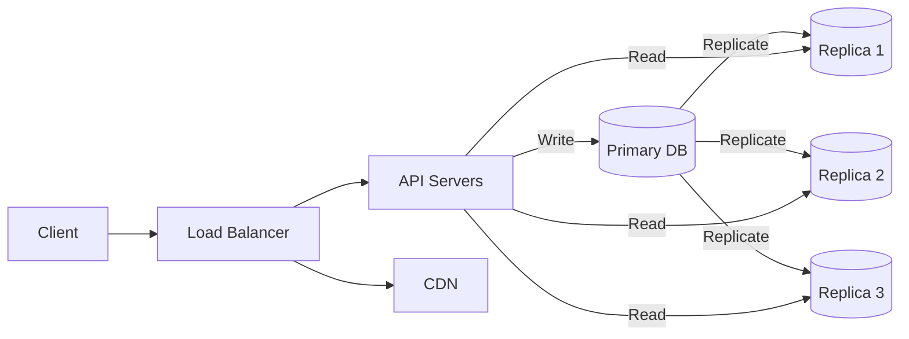
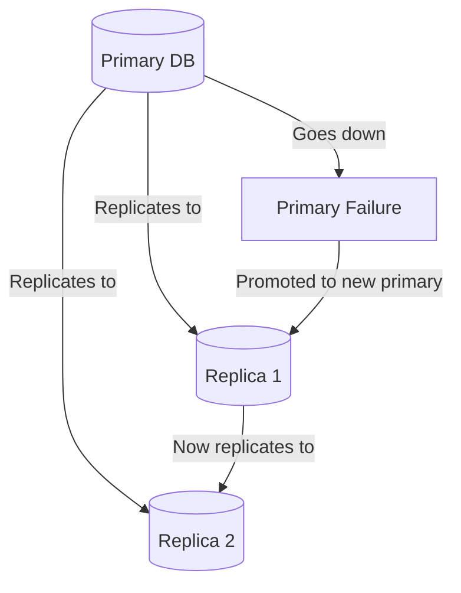
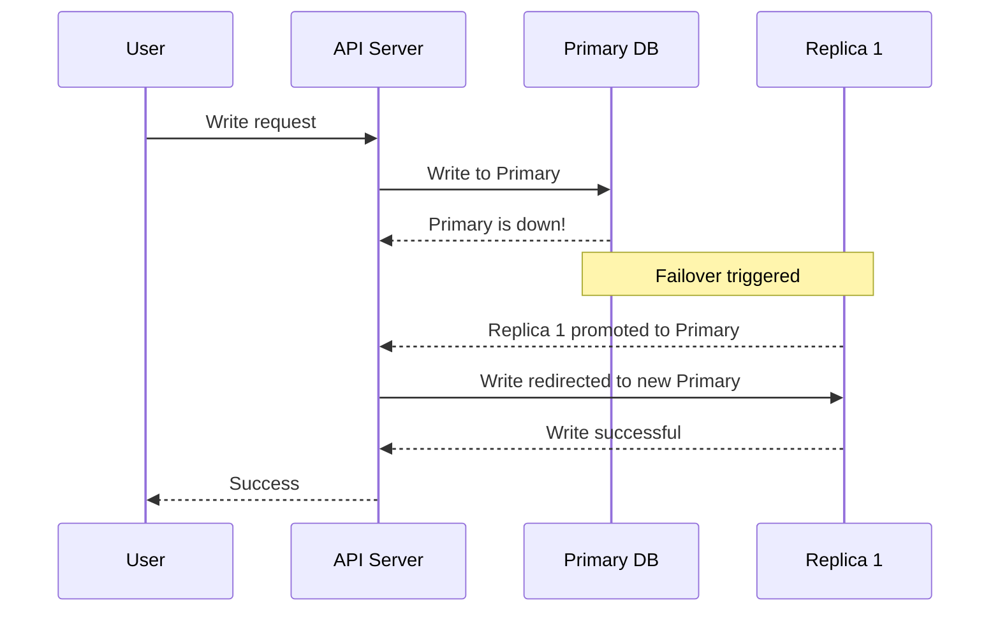
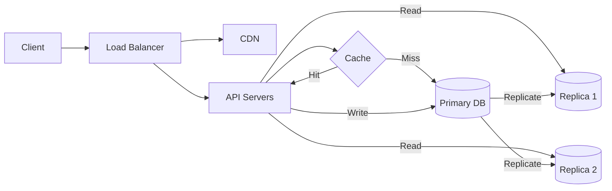

# Replication

Database replication is the most popular approach when it comes to scaling reads.

Suppose you are building Instagram. We can assume there will be **10M DAU (Daily Active Users)** who will be posting photos, liking and commenting on them, and so on. So there will be a lot of reads and writes to the database.

But:

```
reads >> writes
```

The people who check reels daily are far greater in number than the creators. So we will have significantly more reads than writes — and replication is exactly how we scale reads.

---

## Why Do We Need Replication?

Let's say Taylor Swift posts a viral photo on Instagram. She has **100M followers**. The moment that photo goes live, 100M users will try to fetch it, like it, and comment on it — all at the same time.

If we have a **single database**, it will receive millions of requests simultaneously. At some point it will become a bottleneck and eventually reach its **SPOF (Single Point of Failure)** — and go down.

This is where replication comes in.

---

## How Replication Works

We have **one Primary database** that handles all writes, and **multiple Secondary (Replica) databases** that handle all reads.

The primary database continuously replicates data to the secondaries, so they always have the same data.



- **Writes** → always go to the Primary DB
- **Reads** → distributed across Replica DBs

This way we can scale reads simply by adding more replicas — without touching the primary at all.

---

## Benefits of Replication

- **Scalability** — read traffic is distributed across multiple replicas
- **Availability** — if one replica goes down, reads can still be served from the others
- **Performance** — the primary database is not overloaded with read requests and can focus entirely on writes

---

## What if the Primary Database Goes Down?

This is where **failover** comes in.

If the primary database goes down, one of the secondaries is automatically **promoted** to become the new primary. The remaining replicas then start replicating from the newly promoted primary.



This ensures **high availability** and minimises downtime.

---

## What About Writes During Failover?

Here's the tricky part. What if a user tries to **write data exactly when the primary goes down**?

To handle this, we redirect all write requests to the newly promoted primary as soon as the failover is detected. Read requests are also temporarily redirected to the new primary until the remaining replicas finish syncing.



This ensures **no data loss** and keeps the system consistent even during a failure.

---

## Updated Full System Architecture

Putting it all together — here's the complete picture with the Load Balancer, API Servers, Cache, CDN, and Replication all working together:



---

## Summary

| Concept | Key Takeaway |
|---|---|
| Replication | Copies data from primary to one or more secondary databases |
| Primary DB | Handles all writes |
| Replica DB | Handles all reads — scale by adding more replicas |
| Failover | A replica is promoted to primary if the primary goes down |
| Write during failover | Writes are redirected to the newly promoted primary |